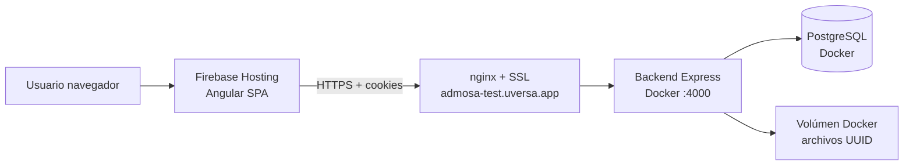
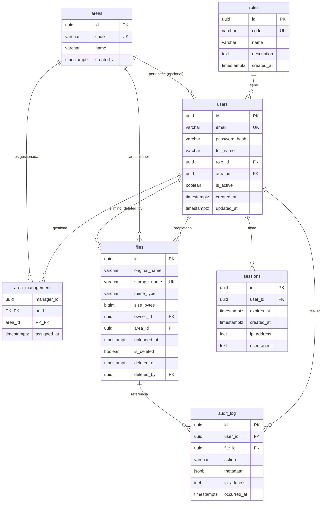

# Manual técnico — ADMOSA

Documentación para evaluadores, DevOps y desarrolladores.

## Repositorio y versionamiento

| Recurso | Enlace / ubicación |
|---------|-------------------|
| **Repositorio Git** | https://github.com/jorpaz/admosa-test |
| **Rama principal** | `main` |
| **Versionamiento** | Git (commits semánticos por feature/fix) |

### Clonar el proyecto

```bash
git clone https://github.com/jorpaz/admosa-test.git
cd admosa-test
```

### Etiquetar una versión de entrega (recomendado)

```bash
git tag -a v1.0.0 -m "Entrega prueba técnica ADMOSA"
git push origin v1.0.0
```

---

## Despliegue en producción

| Componente | URL / hosting |
|------------|---------------|
| Frontend | https://ai-agent-builder-atom.web.app (Firebase Hosting) |
| API | https://admosa-test.uversa.app (nginx + SSL → Docker) |
| Base de datos | PostgreSQL 16 (contenedor Docker, red interna) |

### Arquitectura de despliegue



---

## Stack tecnológico

| Capa | Tecnología |
|------|------------|
| Frontend | Angular 21, Angular Material (Azure Blue) |
| Backend | Node.js 22, Express, TypeScript |
| Base de datos | PostgreSQL 16 |
| Auth | Sesiones server-side, cookie `httpOnly` |
| Archivos | Filesystem local (`storage/`), nombres UUID |
| Contenedores | Docker Compose |
| Proxy / TLS | nginx + Let's Encrypt |

---

## Variables de entorno (producción)

Copiar `.env.example` → `.env` en el servidor (nunca commitear `.env`).

| Variable | Descripción |
|----------|-------------|
| `POSTGRES_USER` / `POSTGRES_PASSWORD` / `POSTGRES_DB` | Credenciales Postgres |
| `SESSION_SECRET` | Secreto de sesión (≥ 32 caracteres) |
| `FRONTEND_URL` | Origen CORS (URL Firebase) |
| `SESSION_COOKIE_SAMESITE` | `none` (cross-domain Firebase ↔ API) |
| `SESSION_COOKIE_SECURE` | `true` (requiere HTTPS) |

Generar secretos:

```bash
openssl rand -hex 32      # POSTGRES_PASSWORD
openssl rand -base64 48   # SESSION_SECRET
```

---

## Levantar el backend (VPN / servidor)

```bash
cp .env.example .env   # completar valores
docker compose up --build -d
curl http://localhost:4000/health
```

nginx debe hacer proxy de `https://admosa-test.uversa.app` → `http://127.0.0.1:4000`.

Ver plantilla: [`deploy/nginx-api.conf.example`](../deploy/nginx-api.conf.example)

---

## Frontend (build y deploy)

`frontend/src/environments/environment.prod.ts`:

```typescript
apiUrl: 'https://admosa-test.uversa.app/api',
```

```bash
cd frontend
npm install
npm run build
firebase deploy --only hosting
```

---

## Diagrama entidad-relación (ER)

Ver también [`docs/DIAGRAMA_ER.md`](./DIAGRAMA_ER.md) con el diagrama ampliado.



### Decisiones de modelo

1. **`area_management` (N:M):** un Gerente puede gestionar varias áreas.
2. **`files.area_id` desnormalizado:** el área se fija al momento de la subida (no cambia si el usuario cambia de área).
3. **Soft delete en `files`:** preserva integridad del historial en `audit_log`.
4. **`roles` como tabla:** extensible sin migraciones de ENUM.
5. **`audit_log.metadata` JSONB:** flexible para distintos tipos de evento.

---

## API REST

Base: `https://admosa-test.uversa.app/api`

### Auth

| Método | Ruta | Descripción |
|--------|------|-------------|
| POST | `/auth/login` | Login, establece cookie de sesión |
| POST | `/auth/logout` | Invalida sesión |
| GET | `/auth/me` | Usuario autenticado |

### Archivos

| Método | Ruta | Descripción |
|--------|------|-------------|
| GET | `/files` | Lista según rol |
| POST | `/files` | Subida (`multipart/form-data`, campo `file`) |
| GET | `/files/:id/download` | Descarga binaria |
| DELETE | `/files/:id` | Soft delete |

### Auditoría

| Método | Ruta | Descripción |
|--------|------|-------------|
| GET | `/audit` | Historial con paginación y filtros |
| GET | `/audit/filters` | Opciones de filtro según rol |

### Admin (solo ADMIN)

| Método | Ruta | Descripción |
|--------|------|-------------|
| GET/POST | `/admin/users` | Listar / crear usuarios |
| PATCH | `/admin/users/:id` | Actualizar usuario |
| GET | `/admin/areas` | Áreas |
| GET | `/admin/roles` | Roles |

---

## Seguridad

| Medida | Implementación |
|--------|----------------|
| Autenticación | Sesiones en DB + cookie `httpOnly` |
| Autorización | `permissionService.ts` → scopes SQL |
| Archivos | Fuera del webroot; UUID en disco; stream vía API |
| Path traversal | Validación en `FileStorage.resolvePath()` |
| Passwords | bcrypt (cost 12) |
| Headers | Helmet |
| CORS | Allowlist (`FRONTEND_URL`) |
| Rate limit | Login (configurable) |
| Validación | Zod en todos los endpoints |

---

## Estructura del repositorio

```
admosa-test/
├── backend/           API Express + TypeScript
├── frontend/          Angular SPA
├── docs/              Manuales y diagramas
├── deploy/            Plantillas nginx
├── docker-compose.yml
├── .env.example       Plantilla de variables (sin secretos)
└── README.md
```

---

## Migraciones y datos de prueba

El contenedor `db-init` ejecuta al arrancar:

1. `migrate.ts` — crea schema desde `migrations/001_initial_schema.sql`
2. `seed.ts` — usuarios y áreas de demo

```bash
docker compose logs db-init
```

---

## Documentación relacionada

- [Manual de usuario](./MANUAL_USUARIO.md)
- [Diagrama ER detallado](./DIAGRAMA_ER.md)
- [README principal](../README.md)
